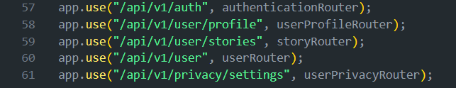

# **Code Documentation**

**Authored by:** Abd El-Rahman Mostafa

---

## **Module Two - User Profile Management**

### **Privacy Settings**

This module manages user privacy settings, allowing control over who can view the user's profile picture, stories, and last seen status.

---

### **Flow Overview**

The flow begins with filtering request endpoints whenever the server receives a request in the **`app.js`** file.

1. **Importing the `userPrivacyRouter`**

   - The `userPrivacyRouter` filters the endpoints requiring privacy-related operations for the user.

   

2. **Adding the Middleware**

   - Integrate the `userPrivacyRouter` within the other middlewares in the application.

   

---

### **Features**

#### **Control Privacy Options**

Users can control visibility settings for:

- Profile Picture
- Stories
- Last Seen

**Available Options:**

- `Everyone`
- `Contacts`
- `Nobody`

---

### **Key Functionality**

#### **`changeProfileVisibility` Function**

This function, located in **`userPrivacyController.js`** within the **`userPrivacy`** subdirectory in the **`controllers`** directory, handles updating the visibility settings.

##### **Definition and Workflow**

1. **Extract Attributes:**

   - Retrieve attributes from the request body:
     - `profilePicture`
     - `stories`
     - `lastSeen`
   - Store them in an object called **`visibilityOptions`**.

2. **Validate Input:**

   - Ensure the extracted options match the available choices (`Everyone`, `Contacts`, `Nobody`).

3. **Service Invocation:**

   - Call the user's service function **`changeProfileVisibilityOptionsByUserId`** to update the visibility settings.

4. **Update Confirmation:**

   - Verify if the update was successful.

5. **Response Handling:**
   - Send an appropriate response to the user indicating the success or failure of the operation.

---

#### **Block/Unblock Specific Users**

**Available Options:**

- `block`
- `unblock`

---

### **Key Functionality**

#### **`changeBlockingStatus` Function**

This function, located in **`userPrivacyController.js`** within the **`userPrivacy`** subdirectory in the **`controllers`** directory, handles updating the visibility settings.

##### **Definition and Workflow**

1. **Extract Attributes and Params:**

   - Retrieve attributes from the request body:
     - `userId` - for the blocked user's id
   - Retrieve params fromm the request params:
     - `action` - the blocking action against the target user

2. **Validate Input:**

   - Ensure the extracted options match the available choices (`block`, `unblock`).

3. **Service Invocation:**

   - Call the user's service function **`changeBlockingStatus`** to update the blocking status for the given blocked user's id from the request body.

4. **Update Confirmation:**

   - Verify if the update was successful.

5. **Response Handling:**
   - Send an appropriate response to the user indicating the success or failure of the operation.

---

#### **Get List of Blocked Users**

### **Key Functionality**

#### **`getBlockedUsers` Function**

This function, located in **`userPrivacyController.js`** within the **`userPrivacy`** subdirectory in the **`controllers`** directory, handles updating the visibility settings.

##### **Definition and Workflow**

1. **Service Invocation:**

   - Call the user's service function **`getBlockedUsers`** to get the blocked users by the current user navigating the application.

2. **Response Handling:**
   - Send an appropriate response to the user indicating the success or failure of the operation.

---

#### **Enable/Disable Read Receipts**

**Available Options:**
The `isEnabled` attribute would be:

- `true`
- `false`

---

### **Key Functionality**

#### **`changeReadReceiptsStatus` Function**

This function, located in **`userPrivacyController.js`** within the **`userPrivacy`** subdirectory in the **`controllers`** directory, handles updating the visibility settings.

##### **Definition and Workflow**

1. **Extract Attributes:**

   - Retrieve attributes from the request body:
     - `isEnabled`

2. **Validate Input:**

   - Ensure the extracted options match the available choices (`true`, `false`).

3. **Service Invocation:**

   - Call the user's service function **`setReadReceiptsStatus`** to update the read-receipts status.

4. **Update Confirmation:**

   - Verify if the update was successful.

5. **Response Handling:**
   - Send an appropriate response to the user indicating the success or failure of the operation.

---

#### **Control Adding Users Privacy**

**Available Options:**
The `newPolicy` attribute would be:

- `Admins`
- `EveryOne`

---

### **Key Functionality**

#### **`changeReadReceiptsStatus` Function**

This function, located in **`userPrivacyController.js`** within the **`userPrivacy`** subdirectory in the **`controllers`** directory, handles updating the visibility settings.

##### **Definition and Workflow**

1. **Extract Attributes:**

   - Retrieve attributes from the request body:
     - `newPolicy`

2. **Validate Input:**

   - Ensure the extracted options match the available choices (`true`, `false`).

3. **Service Invocation:**

   - Call the user's service function **`getAdminMemberShips`** to get the groups/channels the user is an admin of.

4. **Update Confirmation:**

   - Call the groups' service function **`changeGroupsPolicy`**, and the channels' service function **`changeChannelsPolicy`** for updating their policies.

5. **Response Handling:**
   - Send an appropriate response to the user indicating the success or failure of the operation.

---
